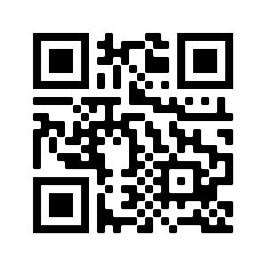
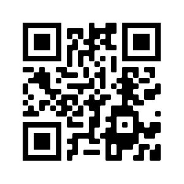

# QR Reader Project. 

A new Flutter project to read QR code.

This app read a QR code and save the scan in a SQLite database. If you scan a website QR, the application redirects to this page automatically. On the other hand if you scan a geolocation QR (*geo:lat,lon* format), you can see the location on a map implemented by Google Maps(this functionality doesn't work on Apple products).

## Examples 

Here are some examples of QR codes to test the functionality of the application.

Geolocation example:

Website example:

You can test the application creating your owns qr codes in the next page:

[QR Code Generator](https://es.qr-code-generator.com)